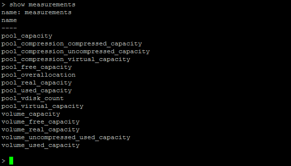
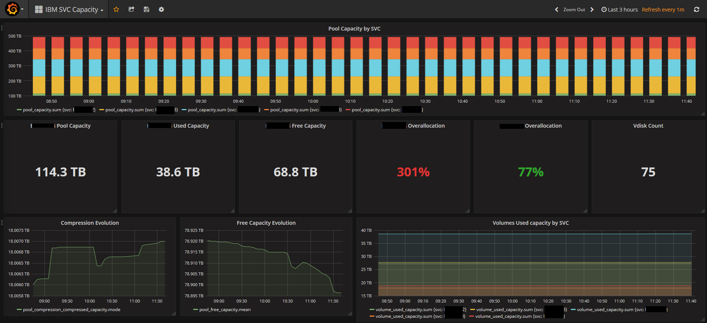

# SVC 2 InfluxDB

A simple storage metrics collector (written in Python) from IBM SVC equipments whose inject them into a InfluxDB database.

Works with all IBM kind of hardware running SVC (FlashSystem V9000, V840, ...)

## Requirements

This script use python 3 and modules like 'paramiko', 'requests' and 'influxdb'. You can install them by using this command line:

`$ pip install -r requirements.txt`

## Usage

`$ svc2influxdb.py your_config.file [--fixed]`

The only required argument is the configuration file.

The --fixed option can be used to force the script to use the same timestamp for the metrics collect from your equipments. It can be helpful to "synchronize" all the metrics collected during a same batch to facilitate the visualization (with Grafana for example).

The time precision used is the millisecond.
The capacity values shown in the __measurements are in bytes__ (think to adjust your data type in Grafana if you use it).


## Configuration

The configuration file use a .ini syntax.

#### Declare your InfluxDB database

```ini
[INFLUXDB]
    address = localhost
    username = youruser
    password = yourpassword
    database = svc2influxdb
```

The INFLUXDB section let you describe the location of your database. The address field is required (can be a name or an IP address).

The fields username and password can be let blank if your database accept anonymous connections.

The database field can be blank. In this case the default database name svc2influxdb will be used. In all cases, the database will be created if it doesn't exists.

#### Add IBM SVC informations

```ini
[YOUR_SVC_NAME]
    address = localhost
    username = your_user
    password = your_password
    sshkey = path_to_ssh_key

    tag_name1 = value1
    tag_name2 = value2
```

You can add any SVC sections you need. The script will be collect the metrics in a sequential mode.

A SVC section use the name of your SVC equipment (a short name or a nickname why not).

The fields address, username and password or ssh_key are required. It's the same informations you use for a SSH connection.

You can also add __tags__ if you need it. These tags are used to described some informations to enrich your time series. For example you can specify if this SVC is used in a production environment or it's location. Example :

```ini
    datacenter = Paris
    room = AB3
```

The key/value pair doesn't matter.
The informations can be used __in your InfluxQL requests__.

## InfluxDB results

The names of the measurements are the same labels shown while you using CLI commands like 'lsvdisk' or 'lsmdiskgrp' (prefixed by 'pool_' or 'volume_' ). Please refer to the IBM online help to get the exact signification of all of them.

List of the measurements:



## Example of data visualization with Grafana



## TODO

Pull requests are welcome ! :smiley:

1. Change the sequential mode to asynchronous mode with the asyncio module
2. Collect not only the storage metrics but also performance metrics

## Miscellaneous

The only commands send to your IBM SVC by this software are :
* lsmdiskgrp
* lsvdisk
* lsvdisk VDISK_ID

## License

This source code is under GNU GPL3 license.
